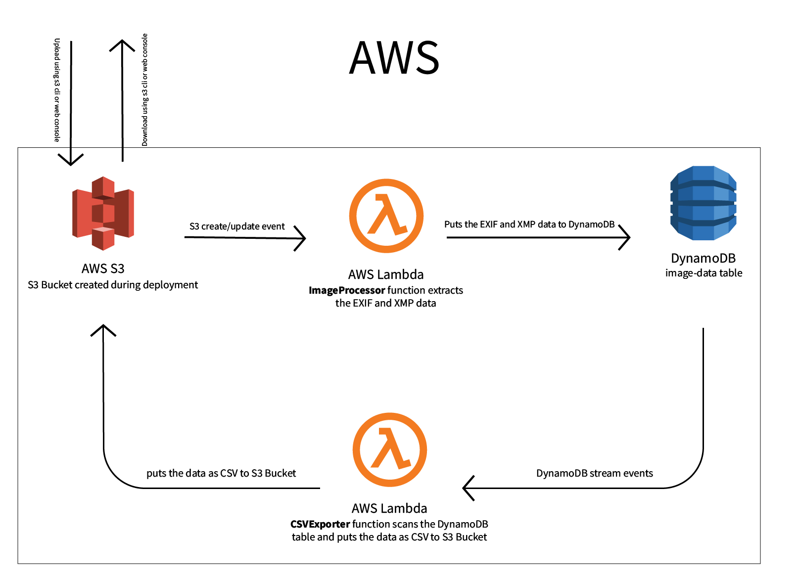

# Skycatch project
This is a evaluatory project for a job interview at Skycatch. 

## Architecture
The system is based on AWS S3, AWS DynamoDB and AWS Lambda. 

### Data extraction
The S3 bucket is configured as a trigger for `ImageProcessor` Lambda function. When
you upload a file to the bucket it triggers an S3 event. The Lambda function uses the
data in event to fetch the related files from S3. Then it does some basic validations
to make sure that it is a valid file. And then it extracts EXIF and XMP data and puts
the data into DynamoDB table using `etag` as primary key.

### Exporting as CSV
A Lambda function `CSVExporter` has the stream of DynamoDB table mentioned above
configure as a trigger. So, when the `ImageProcessor` function puts the data into
DynamoDB, `CSVExporter` scans the table, creates a CSV from that data and puts it
into the S3 bucket under the name `image-data.csv`.

### Why two functions?
Both the image processing and saving the data to S3 can be done in the same function,
but I intentionally stored the data in DynamoDB first because I think that will open
up opportunities for more complex uses of data. Also, the `ImageProcessor` function
runs on each upload, while recreating the CSV file on each upload is possible, it
would be very inefficient.

### Scaling
The whole system is configured in a serverless fashion.
* The data extraction is done on Lambda functions which scale up to your account
concurrency limit and down to zero.
* `ImageProcessor` function runs on each `PutObject:*` event, processing the images
in events, which means that it is generously saleable. And should be able to handle
1 or a thousand of images per second without fail.
* `CSVExporter` function is currently set to run with a batch size of 10 with
DynamoDB steams. This can be fine tuned to get the best results in a production env. 
* The data is stored on S3 and DynamoDB. And DynamoDB table is configured with
`BillingMode: PAY_PER_REQUEST` and only primary key as index, which means that it
can handle burst of read and write without any problem and can scale down
automatically to save on costs.

## Potential uses of data
There is a lot of rich data in each image that includes the horizontal and vertical
position, speed, focus information etc.
* This can be used to construct a Google Street View style viewer for a location that
even goes into nooks, carnies, pipes and tunnels.
* This data can be fed to ML algorithms along with the image data to construct a 3D
object of buildings.

## Flaws
Following are some known flaws in `ImageProcessor` function:
* Library for parsing EXIF data is not as widely used compared to other libs in JS
landscape.
* Library for parsing XMP data is not as widely used compared to other libs in JS
landscape.
* We're throwing an error if the image has more than one instance XMP document
(opening and closing tags). But it is technically possible to have more than documents
in the latest specs.
* We're trying to get `string` value for most of the properties. Which results in
sub-optimal representations some times.
* There is some problem with XP (XP Comment and XP Author) tags representation in
EXIF data.
* There are no CloudWatch alarms configured for errors yet.

Following are some known flaws in `CSVExporter` function:
* It does a `Scan` of DynamoDB, which is resource intensive. I think it can be
configured to work off of Stream event data, and existing data from S3.
* A single `Scan` request can return 1MB of data at most, so, we're re-issuing them
with new parameters until there is no more data. That means that (even though unlikely)
one error in any of them could shut the function down, discarding all of the
fetched data.
* There are no CloudWatch alarms configured for errors yet.

## Usage
It is best if you're testing on a **macOS** system.
* Change `provider.region` in `serverless.yml` to one closest to you.
* Change `provider.environment.S3_BUCKET_NAME` in `serverles.yml` to a unique name for
your S3 bucket.
* `aws configure`. Make sure you have your AWS cli configured
* `npm i -g serverless@latest`. Make sure you have Serverless CLI installed:
* `brew install go`. Make sure you GoLang 1.x installed locally. You may need
to configure your a GOPATH and GOROOT. `mkdir $HOME/.go; export GOPATH="${HOME}/.go";
export GOROOT="$(brew --prefix go)/libexec"`
* Run `deploy` Make routine in project directory: `make deploy`
* `aws s3 cp LOCAL_DIRECTORY_HERE s3://S3_BUCKET_NAME_HERE/ --recursive`. Upload some
photos to the previously mentioned S3 bucket. DynamoDB stream events are configured
to dispatch with a batch size of 10, which triggers `CSVExporter` function. So, make
sure you upload enough photos. You can also do the upload using the AWS S3 Web portal.
* `aws s3 cp s3://S3_BUCKET_NAME_HERE/image-data.csv image-data.csv`. Download the CSV
file from S3. You can also do this using the AWS S3 Web portal.

## Other ways I did this
I tried several different ways of achieving these results. Some of which can be seen
in the git history of this repo.
* I configured a DataPipeline initially to export data as CSV to S3, but then
settled on using a Lambda function because we can do potentially some data cleanup
before saving it.
* Another manual way to export DynamoDB table as CSV is via the
[`export-dynamodb`](https://pypi.org/project/export-dynamodb/) tool. 
* I initially configured everything to work with AWS SAM utility as well, so that,
we can test the functions locally. But later decided to remove it to reduce complexity.
